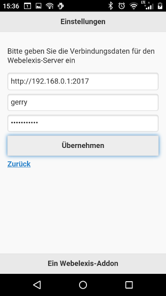

# webelexis-foto

Take a picture with a mobile device and send it to [Webelexis/Janus](https://github.com/rgwch/webelexis). Here's a short (<1 min) [Screencast](http://www.screencast.com/t/jvZDVfQz2XF)
 to show the concept.

This is a very simple [Cordova/PhoneGap](https://cordova.apache.org/) app which runs on Android and iOS Devices. We use it to take pictures of moles and other skin manifestations to monitor changes over time.

## Prerequisites

* The build process is NodeJS-based. So you'll need a running NodeJS v.7.0 or later.

* To build the Android app, you need the Android [SDK](https://developer.android.com/studio/index.html), available for Linux, Mac and Windows computers. (Just for building this app, the SDK is sufficiant, but Google will push you towards downloading the whole Android Studio. It doesn't really matter, but with the SDK alone, you should really love the command line, since you must install all parts manually.

* To build the iOS app, you need a Mac with XCode installed. 

* To build the windows phone app, you need a Windows 8.1 or 10 PC with VisualStudio installed.

* Webelexis-Foto needs a [Janus-Server](https://github.com/rgwch/webelexis/tree/develop/Janus) v 0.3.0 or later to communicate (part of [webelexis](https://github.com/rgwch/webelexis) 2.0.3 and later).

## Build

    git clone https://github.com/rgwch/webelexis-foto
    cd webelexis-foto
    sudo npm install -g cordova
    cordova platform add android
    cordova build android
    
## Run and install development version
    
    # To run on an ADT Emulator
    cordova emulate android
    
    #To install and run on a physically attached device
    cordova run android

## Build and install release version

To build and sign a release version, you'll need an Android developer key. We assume such
  a key named 'developer' in 'android-keystore' here.

    cordova build --release android
    cd platforms/android/build/outputs/apk/
    # sign the .apk with your android developer key
    jarsigner -verbose -keystore android-keystore android-release-unsigned.apk developer
    # Optimize the app with the zipalign tool (found in the Android developer Tools)
    zipalign 4 android-release-unsigned.apk webelexis-foto.apk

To deploy the app on an android device, transfer it using a USB connection, or run a temporary server, e.g.

    php -S 192.168.0.14:10000

And use your mobile's browser to navigate to `http://192.168.0.14:10000/webelexis-foto.apk`. The mobile will then download the app
   and ask, if you would like to install it. (Of course, this works only, if you have "install from unsecure sources" enabled on the phone).
   Say "yes" and you're done. (Instead of `192.168.0.14` you'll enter the real address of your computer, of course).

## Operation

The phone must be in the same WLAN as the Janus Server. Enter settings accordingly. Enter some letters of the patient's first- or lastname and select the matching entry from the list. Then just hit "Bild aufnehmen" and the mobile lets you take a photo and transmits it immediately to the Elexis document manager of the selected patient..

 

## Limitations

Today's mobile devices have increasingly high resolution image sensors (not always with accordingly increasing quality, though). Webelexis accepts data uploads up to 10 MB size this time. Larger data result in an "413" Error (Request entity too large).
If you want increase this, change the limit of bodyParser in Webelexis' "app.js". I think, however, it's better to reduce the image size.

(Note that a large photo will also consume a significant amount of time to transfer via WLAN to the Elexis-Server. Wait for the "OK" message on the mobile's screen before attempting to send more photos.)

